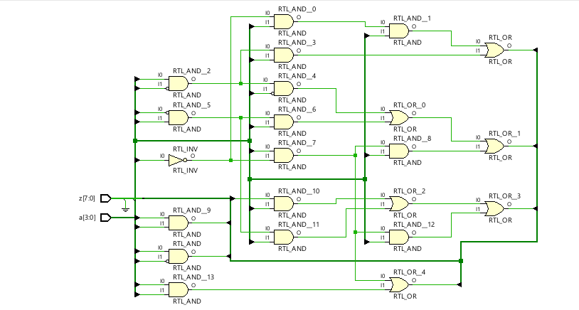
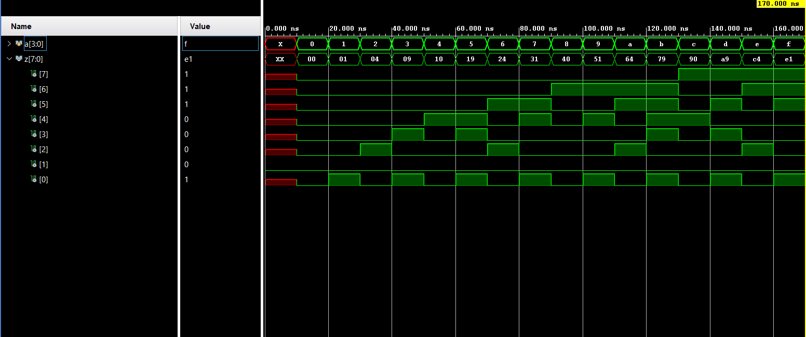

**Code**
```
module Code(
input wire [3:0]a,
input wire [7:0]z
    );
    assign z[7]=a[3]&a[2];
    assign z[6]=(a[3] & (~a[2]))|(a[3]&a[1]);
    assign z[5]=(a[3]&a[2]&a[0])|((~a[3])&a[2]&a[1])|(a[3] & (~a[2])&a[1]);
    assign z[4]=(a[2] & (~a[1]) & (~a[0]))|((~a[3])&a[2]&a[0])|(a[3] & (~a[2])&a[0]);
    assign z[3]=((~a[2]) & a[1] & a[0])|(a[2] & (~a[1])&a[0]);
    assign z[2]=a[1] & (~a[0]);
    assign z[1]=0;
    assign z[0]=a[0];
endmodule
```
**Testbench**
```
module Testbench(

    );
    reg [3:0]a;
    wire [7:0]z;
    Code uut(.a(a),.z(z));
    initial
    begin
    #10
    a=0;
    #10
    a=1;
    #10
    a=2;
    #10
    a=3;
    #10
    a=4;
    #10
    a=5;
    #10
    a=6;
    #10
    a=7;
    #10
    a=8;
    #10
    a=9;
    #10
    a=10;
    #10
    a=11;
    #10
    a=12;
    #10
    a=13;
    #10
    a=14;
    #10
    a=15;
    #10 $finish;
    end    

endmodule
```

