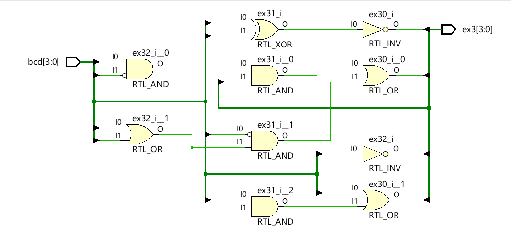
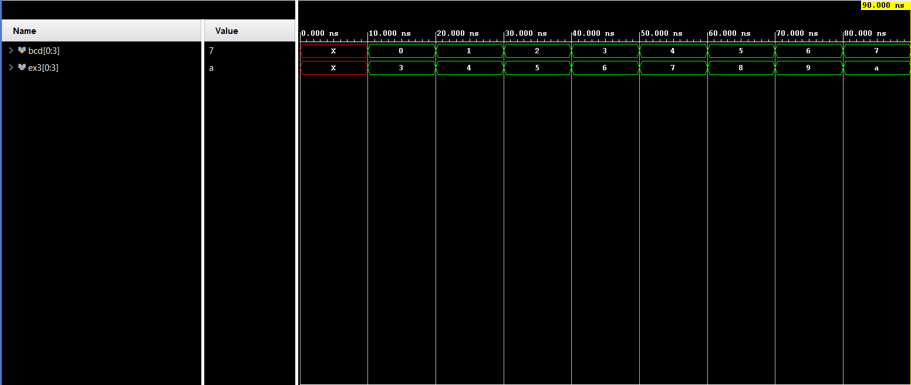

**Code**
```
module Code(input  wire [3:0] bcd,
    output wire [3:0] ex3  
);
    assign ex3[3] = bcd[3] | (bcd[2] & (bcd[1] | bcd[0]));
    assign ex3[2] = (bcd[2] & ~bcd[1] & ~bcd[0]) | (~bcd[2] & (bcd[1] | bcd[0]));
    assign ex3[1] = ~ (bcd[1] ^ bcd[0]);
    assign ex3[0] = ~bcd[0];
endmodule
```
**Testbench**
```
module Testbench(
    );
    reg [0:3]bcd;
    wire [0:3]ex3;
    Code dut(.bcd(bcd), 
		.ex3(ex3));
    initial
    begin
    #10
    bcd=0;   
    #10
    bcd=1;    
    #10
    bcd=2;    
    #10
    bcd=3;    
    #10
    bcd=4;    
    #10
    bcd=5;    
    #10
    bcd=6;    
    #10
    bcd=7;    
    #10  
    $finish;
    end    
endmodule
```

