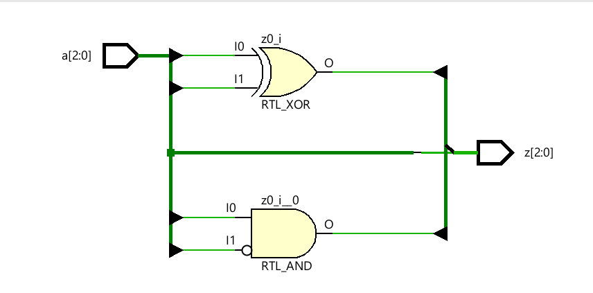
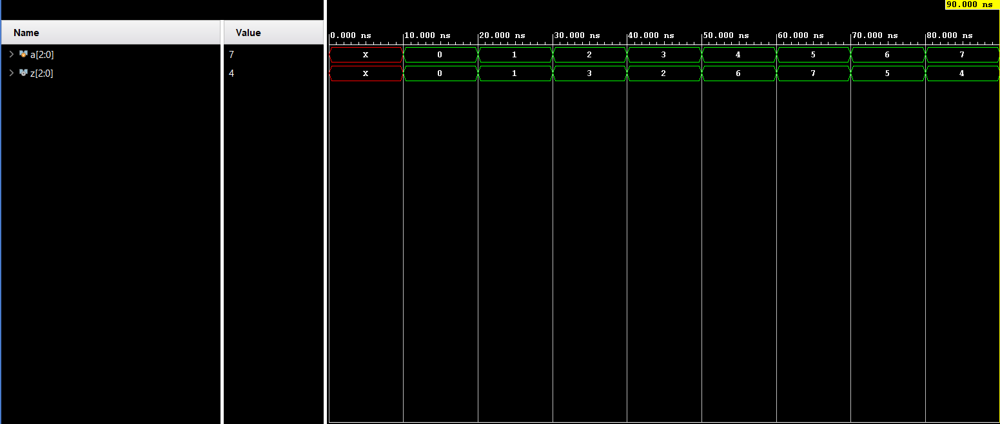

**Code**
```
module Code(
input wire [2:0]a,
output wire [2:0]z
    );
    assign z[2]=a[2];
    assign z[1]=a[2]^a[1];
    assign z[0]=a[1]^a[0];
endmodule
```
**Testbench**
```
module Testbench(
    );
    reg [2:0]a;
    wire [2:0]z;
    Code uut(.a(a),.z(z));
    initial
    begin
    #10
    a=0;
    #10
    a=1;
    #10
    a=2;
    #10
    a=3;
    #10
    a=4;
    #10
    a=5;
    #10
    a=6;
    #10
    a=7;
    #10 $finish;
    end    
endmodule
```

