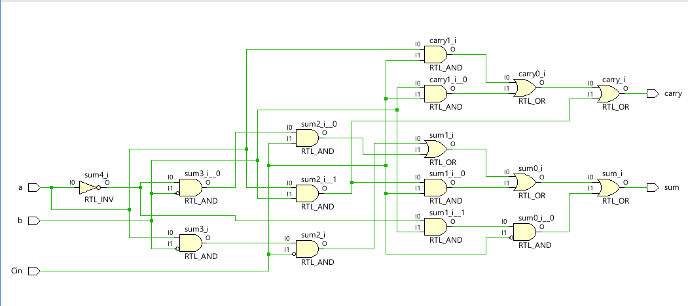
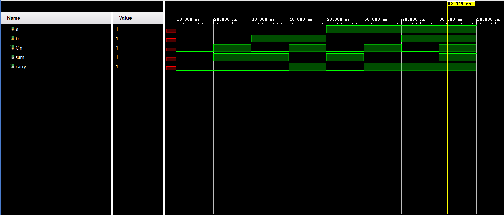

**Code**
```
module Code(
input wire a,b,Cin,
output wire sum,carry
    );
    assign sum= (a&~b&~Cin)|(~a&~b&Cin)|(a&b&Cin)|(~a&b&~Cin);
    assign carry=(a&Cin)|(b&Cin)|(a&b);
endmodule
```
**Testbench**
```
module Testbench(

    );
    reg a,b,Cin;
    wire sum,carry;
    Code uut(a,b,Cin,sum,carry);
    initial
    begin
    #10
    a=0; b=0; Cin=0;
    #10
    a=0; b=0; Cin=1;
    #10
    a=0; b=1; Cin=0;
    #10
    a=0; b=1; Cin=1;
    #10
    a=1; b=0; Cin=0;
    #10
    a=1; b=0; Cin=1;
    #10
    a=1; b=1; Cin=0;
    #10
    a=1; b=1; Cin=1;
    #10 $finish;
    end
endmodule
```

