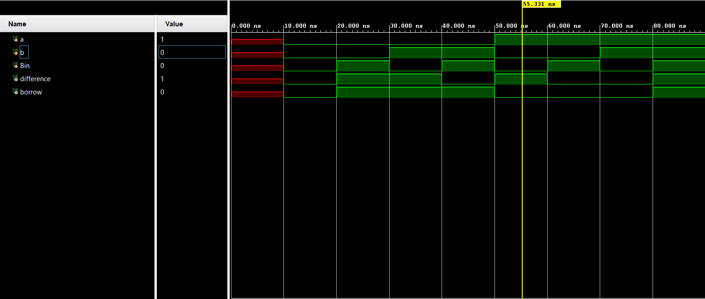

**Code**
```
module Code(
input wire a,b,Bin,
output wire borrow,difference
    );
    assign difference= (a&~b&~Bin)|(~a&~b&Bin)|(a&b&Bin)|(~a&b&~Bin);
    assign borrow=(~a&Bin)|(~a&b)|(b&Bin);
endmodule
```
**Testbench**
```
module Testbench(

    );
    reg a,b,Bin;
    wire difference,borrow;
    Code uut(a,b,Bin,borrow,difference);
    initial
    begin
    #10
    a=0; b=0; Bin=0;
    #10
    a=0; b=0; Bin=1;
    #10
    a=0; b=1; Bin=0;
    #10
    a=0; b=1; Bin=1;
    #10
    a=1; b=0; Bin=0;
    #10
    a=1; b=0; Bin=1;
    #10
    a=1; b=1; Bin=0;
    #10
    a=1; b=1; Bin=1;
    #10 $finish;
    end

endmodule
```

